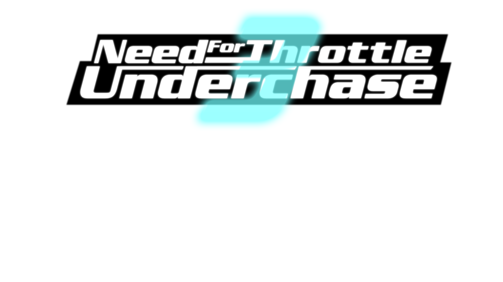

<h1 align="center">Need For Throttle Underchase 3</h1>

- Open world racing game, which is made in Godot Engine
---
- Game is under development from the year 2021
- Current version of game : Alpha-Dev 0.1.31
---
- Game is updating actively on Discord and maybe soon on Github
- You can find download link and more information about NFTUC3 project on Discord channel "https://discord.gg/gZ7zfc2T"

<h1 align="center">Screenshots</h1>
<h5 align="center">MainMenu & Settings</h5>
 

<h5 align="center">Cars</h5>
       

